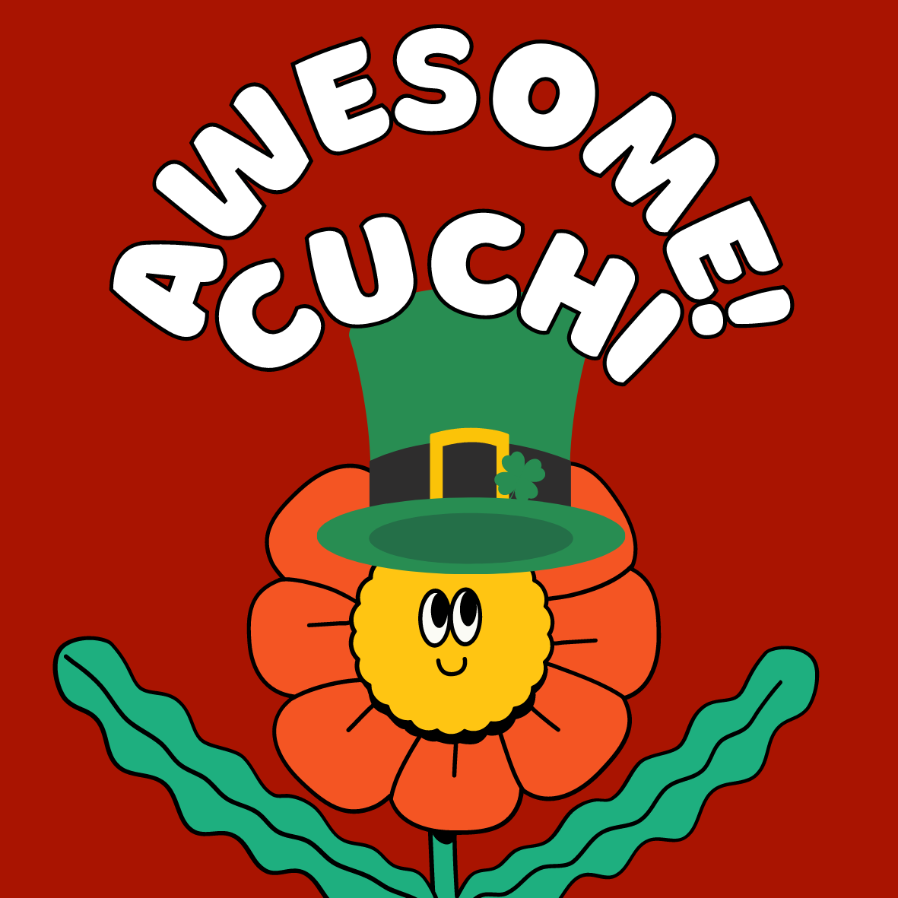

  

    
  

  <h3><a href="https://awesome-ruby.com">Awesome Cuchi</a></h3>
  

    
  

A categorized community-driven collection of awesome Cuchi libraries, tools, frameworks and software. The essential Cuchi to build modern Apps and Web Apps.

* [Art](#art)
* [Fun and Games](#fun-and-games)
* [Genesis](#genesis)
* [Gems and Libraries](#gems-and-libraries)
* [Motivational](#motivational)
* [Sound and Music](#sound-and-music)

## Art
* [ASCUCHIII](https://github.com/kammradt/ascuchiii) - [You can access it here](https://github.com/kammradt/ascuchiii/). computer A gem to get a cute ASCII cuchi easily aka ASCUCHIII computer. 

## Fun and games
* [Cuchile](https://github.com/VGasparini/cuchile) - [You can access it here](https://cuchile.vercel.app/). One of the most 2022 hyped games now with Cuchi's flavor. 

## Genesis
* [Personal Cuchi Website](https://github.com/cuchi/website) - [You can access it here](https://cuchi.me/). Personal page at https://cuchi.me

## Gems and Libraries
* [Cuchinizer](https://github.com/kammradt/cuchinizer) - [You can access it here](https://rubygems.org/gems/cuchinizer). :gem: A very powerfull tool to write ruby code just using `cuchi` :gem:

## Motivational
* [Paulocoachi](https://github.com/kammradt/paulocoachi) - [You can access it here](https://paulocoachi.vercel.app/). O nome já explica muito bem

## Sound and Music
* [Arcuchicionado](https://github.com/henrilhos/arcuchicionado) - [You can access it here](https://arcuchicionado.vercel.app/). Ar Cuchicionado é um CaaS (Cuchi as a Service) para todos aqueles que estão sentindo calor e precisam se refrescar nesse clima tropical.

 
 

# Next ideas :rocket:

- A 2D snake-like game where Cuchi is eating a lot of beers and getting stronger  
- An extension that will replace all images on the html to Cuchi images [example](https://chrome.google.com/webstore/detail/ncage/mpnfndnehgmmonhfcfdnaemdeokofgaf?hl=pt-BR)
- An extension that will have a little Cuchi to mess around your browser [example](https://chrome.google.com/webstore/detail/shimeji-browser-extension/gohjpllcolmccldfdggmamodembldgpc)

